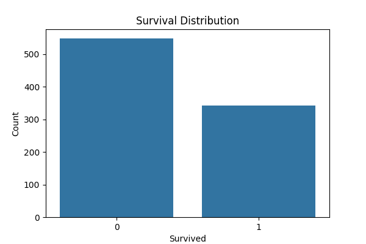
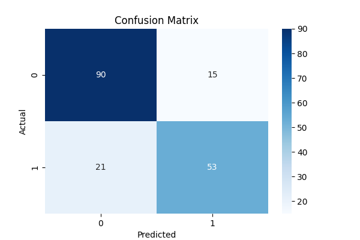
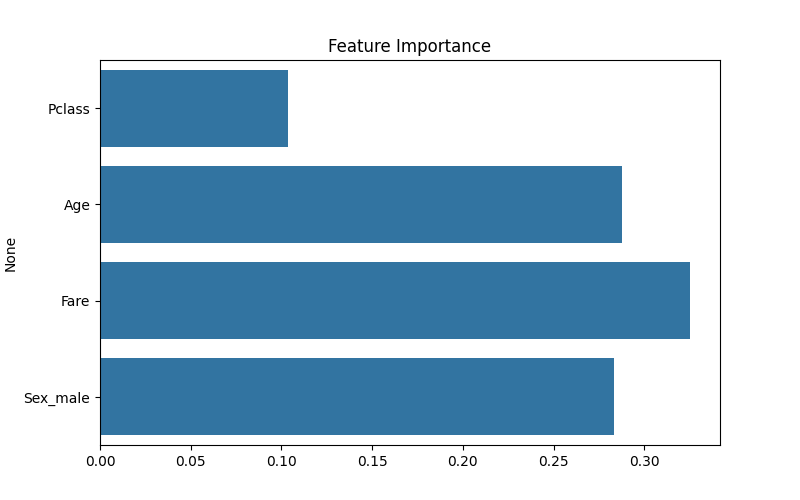

# ML-Classification-Titanic
This project is a Machine Learning classification model to predict the survival of passengers on the Titanic using the famous Titanic dataset. It demonstrates basic data exploration, preprocessing, model training, evaluation, and visualization.  
# Titanic Survival Prediction (Machine Learning)

This project builds a Machine Learning classification model to predict whether a passenger survived the Titanic disaster.

Dataset
Titanic Dataset

Project Steps
1. Data Exploration
2. Data Preprocessing
3. Model Training
4. Model Evaluation
5. Feature Importance Analysis

Technologies Used
Python
Pandas
Scikit-learn
Matplotlib
Seaborn

Results

## Survival Distribution

## Confusion Matrix

## Feature Importance

## Dataset Preview

Model Used
Random Forest Classifier
